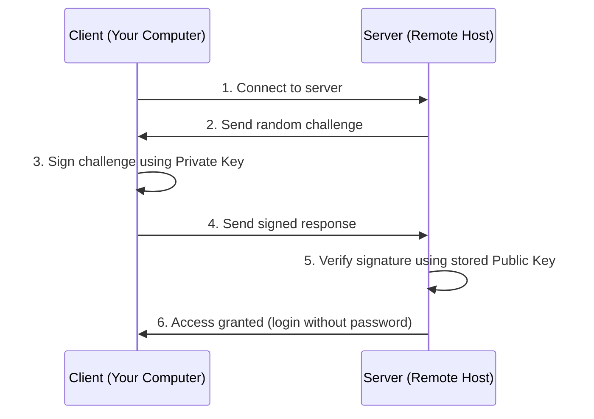
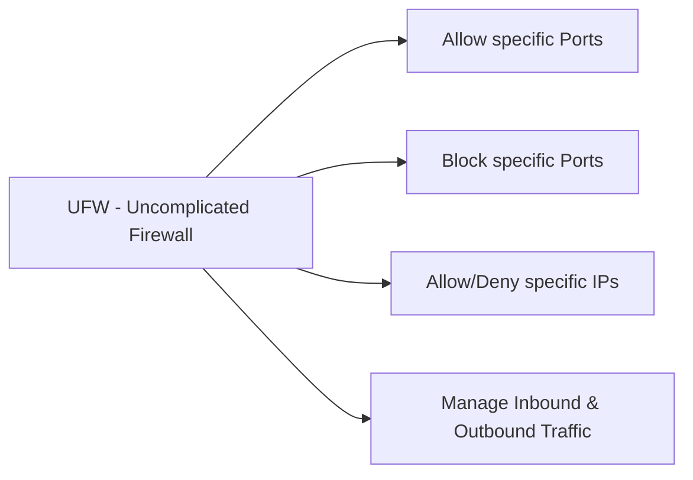

# Class 04 — SSH (Secure Shell)

*Fluresta Cloud And Networking Institute (FCNI)*
WhatsApp: +88 01553207425 | fcni.com.bd

---

## 1. What is SSH?

**SSH** stands for **Secure Shell**.

SSH is a network protocol used to establish a secure, encrypted connection between two computers. It is primarily used to log in to a remote server or computer securely and execute commands on it.

### When is SSH used?

| Use Case | Description |
|---|---|
| **Remote Login** | Accessing a remote server's terminal |
| **File Transfer** | Securely transferring files using SCP or SFTP |
| **Command Execution** | Running commands on a remote server |
| **Tunneling / Port Forwarding** | Creating a secure data tunnel |
| **Git Authentication** | Securely pushing/pulling from GitHub, GitLab, etc. |

### Why is SSH important?

Before SSH, **Telnet** was used, which sent data as plain text (unencrypted) — creating a risk of password or data theft. SSH encrypts all data before sending it, making it far more secure.

```
telnet <IP> <PORT>
telnet 172.20.10.44 22
```

---

## 2. Secure SSH from Different Operating Systems

From any OS, we can log in to a server via SSH using:

```
ssh ripon@172.20.10.44 -p 22
```

| Part | Meaning |
|---|---|
| `ripon` | Username of the target server |
| `172.20.10.44` | Target server's IP address |
| `-p` | The port SSH will use (default is `22`, but customizable) |

> **Note:** To log in via SSH, the target server must have the SSH service installed and enabled.

### Debian-based Server (Ubuntu, Debian)

```bash
# Update package list
sudo apt update

# Install OpenSSH server
sudo apt install openssh-server -y

# Start the SSH service
sudo systemctl start ssh

# Enable SSH to start automatically on boot
sudo systemctl enable ssh

# Check SSH service status
sudo systemctl status ssh
```

### Red Hat-based Server (RHEL, CentOS, Rocky Linux, Alma Linux)

```bash
# Update package list
sudo dnf update

# Install OpenSSH server
sudo dnf install openssh-server -y

# On older versions (CentOS 7 / RHEL 7), use yum instead of dnf:
sudo yum install openssh-server -y

# Start the SSH service
sudo systemctl start sshd

# Enable SSH to start automatically on boot
sudo systemctl enable sshd

# Check SSH service status
sudo systemctl status sshd
```

---

## 3. Setup SSH Key-Based Authentication

### What is it?

SSH Key-Based Authentication is a method of logging into a server where, instead of a password, a pair of **cryptographic keys** (Public Key and Private Key) is used to verify identity. This is far more secure than password authentication because it is nearly impossible to break a key with brute-force attacks.

### How it Works

| Key Type | Description |
|---|---|
| **Private Key** | Stays on your own computer, must be kept secret, never shared |
| **Public Key** | Placed on the server you want to log into (in `~/.ssh/authorized_keys`) |

During login, the server sends a challenge, and your computer signs it with the Private Key and sends it back. The server verifies it using the Public Key. As a result, plain-text passwords never need to travel across the network.

### Authentication Flow



### Key Locations

| Key | Location | Shareable? |
|---|---|---|
| Private Key (Client) | `~/.ssh/id_ed25519` | ❌ Never share |
| Public Key (Server) | `~/.ssh/authorized_keys` | ✅ Safe to share |

---

## 4. Generating an SSH Key Pair (Debian-based Distro)

```bash
ssh-keygen -t ed25519 -C "Office Desktop"
```

> For older systems, you may use `-t rsa -b 4096` instead.

You may optionally set a password on top of the SSH key.

After generating the key, go inside the `.ssh` directory and list files:

```bash
ls -la
```

> ⚠️ **Important:** Only share the `id_ed25519.pub` file (the public key) with remote servers or others. The private key `id_ed25519` must **never** be shared.

### Uploading the Public Key to the Server

```bash
ssh-copy-id -i id_ed25519.pub root@172.20.10.44
```

This copies your public key onto the target server so that afterward, you can log in **without a password**.

Once done, you can log in with:

```bash
ssh root@172.20.10.44
```

After logging in, you'll find your uploaded key inside `.ssh/authorized_keys` on the server.

---

## 5. Passwordless Login Using a Config Alias (FQDN)

For even more convenience and security, we can log in using a custom hostname (alias) instead of typing the IP each time.

**Step 1:** On the **client machine** (the PC/laptop you're logging in *from*), create a `config` file inside the `.ssh` directory:

```bash
vim ~/.ssh/config
```

**Step 2:** Add the following configuration:

```
Host fileserver.com
    HostName 172.20.10.44
    User root
    Port 22
    IdentityFile ~/.ssh/id_ed25519
    IdentitiesOnly yes
    ServerAliveInterval 20
    ServerAliveCountMax 2
```

### Config Parameters Explained

| Parameter | Meaning |
|---|---|
| `Host` | A nickname/alias you choose freely (not the real IP/domain) |
| `HostName` | The actual IP address of the server you want to log into |
| `User` | Username on the server |
| `Port` | The port used to access the server |
| `IdentityFile` | Which private key to use |
| `IdentitiesOnly` | Restricts SSH to only try the specified key (see below) |
| `ServerAliveInterval` | Interval (sec) at which client sends a keepalive packet |
| `ServerAliveCountMax` | Max missed keepalive responses before disconnecting |

#### Why `IdentitiesOnly` matters

Without it, the SSH Agent may try **every key** it has stored, one by one:

- `id_rsa`
- `id_ecdsa`
- `id_ed25519`
- `company_key`
- `office_key`
- `aws_key`

If too many wrong keys are tried before the correct one, the server may close the connection due to repeated authentication failures.

#### Keepalive Timing Example

```
Interval = 20 sec
Count    = 2
---------------------
Total timeout before disconnect = 20 × 2 = 40 sec
```

If the server doesn't respond within ~40 seconds, the SSH connection will be closed.

### Logging in With the Alias

Once the config file is saved, you can log in without typing the IP:

```bash
ssh root@fileserver.com
```

---

## 6. SSH from a Windows PC (Client)

Navigate to:
```
This PC → C Drive → Users → Monir (Username)
```
Open **PowerShell** in this location and run:

```powershell
ssh-keygen -t ed25519 -C "Monir Desktop"
```

| Flag | Meaning |
|---|---|
| `ssh-keygen` | Command to generate a new SSH key pair |
| `-t ed25519` | Uses the Ed25519 algorithm to generate the key (a good modern default) |
| `-C "Monir Desktop"` | Adds a comment to the public key, useful for identifying the key later |

### Manually Copying the Public Key (Windows)

`ssh-copy-id` is not available on Windows like it is on Linux. Instead:

1. Run `cat` (or `type`) on the `id_ed25519.pub` file to view its contents.
2. Copy the output.
3. Manually log in to the server.
4. Paste the copied key into `.ssh/authorized_keys` on the server.

```bash
vim authorized_keys
# paste the copied public key, then save
```

---

## 7. Restarting SSH After Adding a Key

Depending on the server's OS, restart the appropriate service after manually adding a public key:

### Debian/Ubuntu-based Server

```bash
systemctl restart ssh.service
systemctl status ssh.socket
```

### Red Hat-based Server

```bash
systemctl restart sshd.service
```

---

## 8. Customizing the Default SSH Port on Ubuntu Server

**Step 1:** Edit the SSH daemon config file:

```bash
sudo vim /etc/ssh/sshd_config
```

**Step 2:** Find the commented line `#Port 22`, remove the `#`, and set a custom port, e.g.:

```
Port 2002
```

**Step 3:** Validate the configuration:

```bash
sudo sshd -t
```

> No output = configuration is valid.

### Checking and Enabling the Firewall (UFW)

```bash
sudo ufw status
```

If the firewall shows:
```
Status: inactive
```
enable it:

```bash
sudo ufw enable
```

Expected output:
```
Firewall is active and enabled on system startup
```

Re-check status:

```bash
sudo ufw status
```

### Allowing the New SSH Port

```bash
sudo ufw allow 2002/tcp
```

### Removing the Old Default Port (22)

First list the numbered rules:

```bash
sudo ufw status numbered
```

Suppose `22/tcp` is `Rule [1]`, then delete it:

```bash
sudo ufw delete 1
```

### Restart SSH Services

```bash
systemctl restart ssh.service
systemctl restart ssh.socket
```

### Logging in on the Custom Port

```bash
ssh ripon@192.168.122.10 -p 2002
```

> ⚠️ **Note:** Enabling `ufw` is **not mandatory** just to change the SSH port — but it is strongly recommended for security.

---

## 9. What is UFW?

**UFW (Uncomplicated Firewall)** is Ubuntu's easy-to-use firewall management tool. It works on top of the Linux kernel's Netfilter/iptables/nftables, but with much simpler commands.

### UFW's Responsibilities



---

## 10. Linux Directory Structure Reference

| Directory | Purpose / Description |
|---|---|
| `/bin` | Essential user command binaries |
| `/boot` | Static files of the boot loader |
| `/dev` | Device files |
| `/etc` | Host-specific system configuration |
| `/home` | User home directories |
| `/lib` | Shared libraries |
| `/media` | Removable media |
| `/mnt` | Temporarily mounting filesystems |
| `/opt` | Add-on application software packages |
| `/sbin` | System binaries |
| `/srv` | Data for services provided by this system |
| `/tmp` | Temporary files |
| `/usr` | User utilities and applications |
| `/proc` | Process information |

```mermaid
flowchart TD
    ROOT["/ (Root Directory)"] --> bin[/bin]
    ROOT --> boot[/boot]
    ROOT --> dev[/dev]
    ROOT --> etc[/etc]
    ROOT --> home[/home]
    ROOT --> lib[/lib]
    ROOT --> media[/media]
    ROOT --> mnt[/mnt]
    ROOT --> opt[/opt]
    ROOT --> sbin[/sbin]
    ROOT --> srv[/srv]
    ROOT --> tmp[/tmp]
    ROOT --> usr[/usr]
    ROOT --> proc[/proc]
```

---

*Fluresta Cloud And Networking Institute (FCNI) — fcni.com.bd*
