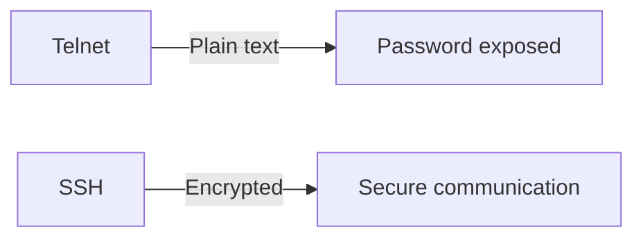
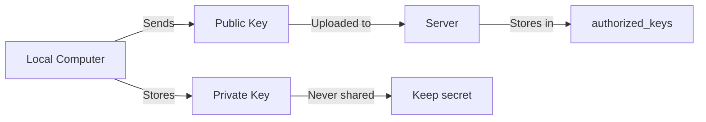
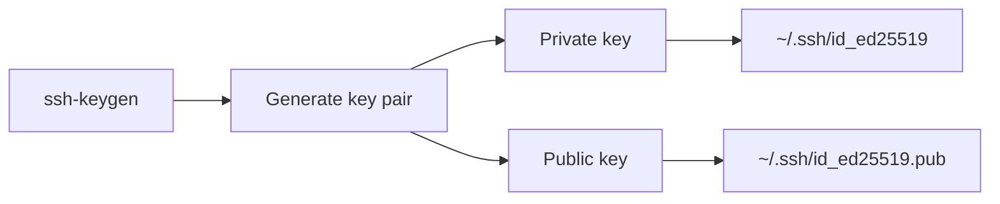
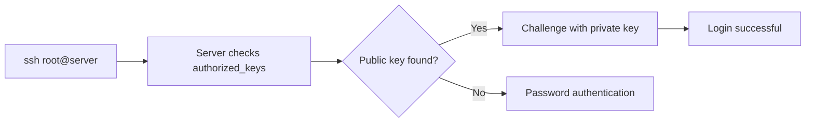
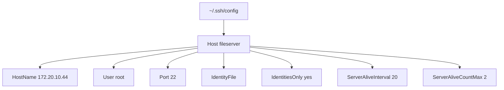

# SSH (Secure Shell) - Complete Study Notes

> Based on Class-04 with additional explanations and best practices.

---

# Table of Contents

1. [What is SSH?](#1-what-is-ssh)
2. [Why SSH is Important](#2-why-ssh-is-important)
3. [Common Uses of SSH](#3-common-uses-of-ssh)
4. [Testing SSH Port](#4-testing-ssh-port)
5. [Connecting to a Server](#5-connecting-to-a-server)
6. [SSH Key Authentication](#6-ssh-key-authentication)
7. [Generating SSH Keys](#7-generating-ssh-keys)
8. [Copying Public Keys to Server](#8-copying-public-keys-to-server)
9. [Passwordless Login](#9-passwordless-login)
10. [SSH Config File](#10-ssh-config-file)
11. [Connecting Using Host Alias](#11-connecting-using-host-alias)
12. [Windows SSH Key Setup](#12-windows-ssh-key-setup)
13. [Best Practices](#13-best-practices)

---

# 1. What is SSH?

**SSH (Secure Shell)** is a network protocol that allows two computers to communicate securely over an encrypted connection.

It is mainly used for:

- Remote server login
- Executing commands
- File transfer
- Port forwarding
- Git authentication

Unlike Telnet, SSH encrypts all transmitted data, making it much more secure.

---

# 2. Why SSH is Important

Before SSH, administrators used **Telnet**.

The problem with Telnet was:

- Passwords were sent as plain text.
- Anyone intercepting the traffic could read the credentials.
- No encryption.

SSH solves these issues by encrypting all communication between the client and the server.



---

# 3. Common Uses of SSH

## Remote Login

Connect to a Linux server securely.

Example:

```bash
ssh user@192.168.1.100
```

---

## File Transfer

SSH also provides secure file transfer through:

- SCP
- SFTP

Example:

```bash
scp file.txt user@192.168.1.100:/home/user/
```

---

## Remote Command Execution

Run commands without opening a full interactive shell.

Example:

```bash
ssh user@192.168.1.100 "uptime"
```

---

## Port Forwarding

Create encrypted tunnels.

Useful for:

- Database access
- Secure web access
- Internal services

---

## Git Authentication

SSH is widely used with:

- GitHub
- GitLab
- Bitbucket

Example:

```bash
git clone git@github.com:user/project.git
```

---

# 4. Testing SSH Port

Before connecting, check whether SSH service is reachable.

Using Telnet:

```bash
telnet 172.20.10.44 22
```

If the connection succeeds, port 22 is open.

> Modern alternatives:
>
> ```bash
> nc -zv 172.20.10.44 22
> ```
>
> or
>
> ```bash
> ssh user@172.20.10.44
> ```

---

# 5. Connecting to a Server

General syntax:

```bash
ssh username@server-ip -p port
```

```mermaid
flowchart LR
    A[ssh] --> B[username@server-ip]
    B --> C[-p port]
    C --> D[Establishes encrypted connection]
```

Example:

```bash
ssh ripon@172.20.10.44 -p 22
```

Explanation:

- `ripon` → Username
- `172.20.10.44` → Server IP
- `-p` → SSH Port
- Default SSH Port = **22**

---

# 6. Installing OpenSSH Server

## Debian / Ubuntu

Update package list:

```bash
sudo apt update
```

Install OpenSSH:

```bash
sudo apt install openssh-server -y
```

Start SSH:

```bash
sudo systemctl start ssh
```

Enable at boot:

```bash
sudo systemctl enable ssh
```

Check status:

```bash
sudo systemctl status ssh
```

---

## RHEL / CentOS / Rocky / AlmaLinux

Update packages:

```bash
sudo dnf update
```

Install OpenSSH:

```bash
sudo dnf install openssh-server -y
```

Older systems:

```bash
sudo yum install openssh-server -y
```

Start SSH:

```bash
sudo systemctl start sshd
```

Enable SSH:

```bash
sudo systemctl enable sshd
```

Status:

```bash
sudo systemctl status sshd
```

---

# 7. SSH Key Authentication

Instead of passwords, SSH can authenticate using a **public/private key pair**.

Benefits:

- More secure
- Resistant to brute-force attacks
- Convenient
- Passwordless login

---

## How It Works

### Private Key

Stored on your local computer.

Example:

```
~/.ssh/id_ed25519
```

Never share this file.

---

### Public Key

Uploaded to the server.

Example:

```
~/.ssh/id_ed25519.pub
```

This file is safe to share.



---

# 8. Generate SSH Keys

Recommended algorithm:

```bash
ssh-keygen -t ed25519 -C "Office Desktop"
```



Explanation:

- `ssh-keygen` → Generate SSH keys
- `-t ed25519` → Use Ed25519 algorithm
- `-C` → Add a comment

For older systems:

```bash
ssh-keygen -t rsa -b 4096
```

---

# 9. View Generated Keys

Go to the SSH directory:

```bash
cd ~/.ssh
```

List files:

```bash
ls -la
```

Typical output:

```
id_ed25519
id_ed25519.pub
known_hosts
config
```

Remember:

| File | Purpose |
|------|----------|
| id_ed25519 | Private key (keep secret) |
| id_ed25519.pub | Public key (upload to server) |

---

# 10. Upload Public Key to Server

Linux provides a convenient command:

```bash
ssh-copy-id -i ~/.ssh/id_ed25519.pub root@172.20.10.44
```

This copies the public key into:

```
~/.ssh/authorized_keys
```

on the remote server.

---

# 11. Passwordless Login

Once the public key is installed:

```bash
ssh root@172.20.10.44
```

No password is required (unless the private key has a passphrase).



---

# 12. SSH Config File

Instead of typing the full command every time, create:

```
~/.ssh/config
```

Example:

```text
Host fileserver
    HostName 172.20.10.44
    User root
    Port 22
    IdentityFile ~/.ssh/id_ed25519
    IdentitiesOnly yes
    ServerAliveInterval 20
    ServerAliveCountMax 2
```



---

## Explanation

### Host

A nickname.

```
fileserver
```

---

### HostName

Actual server IP or domain.

---

### User

Default SSH username.

---

### Port

SSH port.

Usually:

```
22
```

---

### IdentityFile

Private key path.

---

### IdentitiesOnly

Use only the specified key.

---

### ServerAliveInterval

Send keep-alive packets every 20 seconds.

---

### ServerAliveCountMax

Disconnect after two missed responses.

---

# 13. Connect Using Host Alias

Instead of:

```bash
ssh root@172.20.10.44
```

Simply use:

```bash
ssh fileserver
```

This is easier and avoids repeatedly typing IP addresses.

---

# 14. Windows SSH Key Setup

Windows also includes OpenSSH.

Generate a key:

```powershell
ssh-keygen -t ed25519 -C "My Desktop"
```

Keys are stored in:

```
C:\Users\<username>\.ssh\
```

Files:

```
id_ed25519
id_ed25519.pub
```

---

# 15. Copy Public Key on Windows

Windows does not include `ssh-copy-id` by default.

Steps:

1. Open `id_ed25519.pub`.
2. Copy its contents.
3. SSH into the server using a password.
4. Open:

```
~/.ssh/authorized_keys
```

5. Paste the copied key.
6. Save the file.

---

# 16. Best Practices

- Use **Ed25519** keys when possible.
- Never share your private key.
- Protect your private key with a passphrase.
- Disable password authentication after configuring key-based login (if appropriate).
- Disable direct root login and use a regular user with `sudo`.
- Keep OpenSSH updated.
- Use firewalls to restrict SSH access.
- Consider changing the default SSH port only as a minor deterrent, not as a replacement for proper security.

---

# Summary

SSH provides a secure way to:

- Log in to remote servers
- Execute commands
- Transfer files
- Manage servers
- Authenticate with Git services

The recommended authentication method is **SSH Key Authentication**, which uses a private key stored securely on your computer and a public key installed on the server. This eliminates the need to transmit passwords over the network and offers stronger security.
