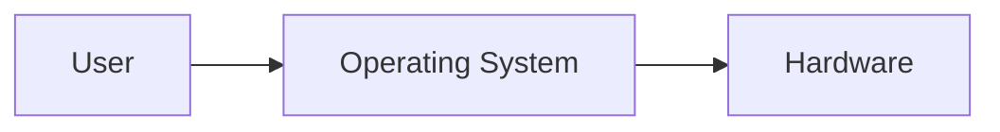
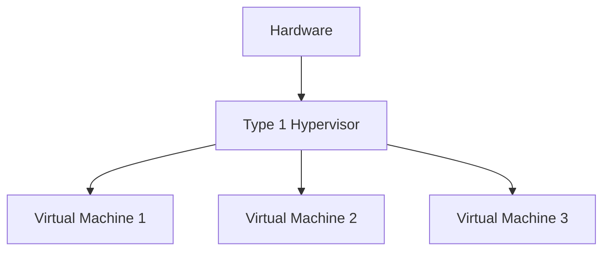
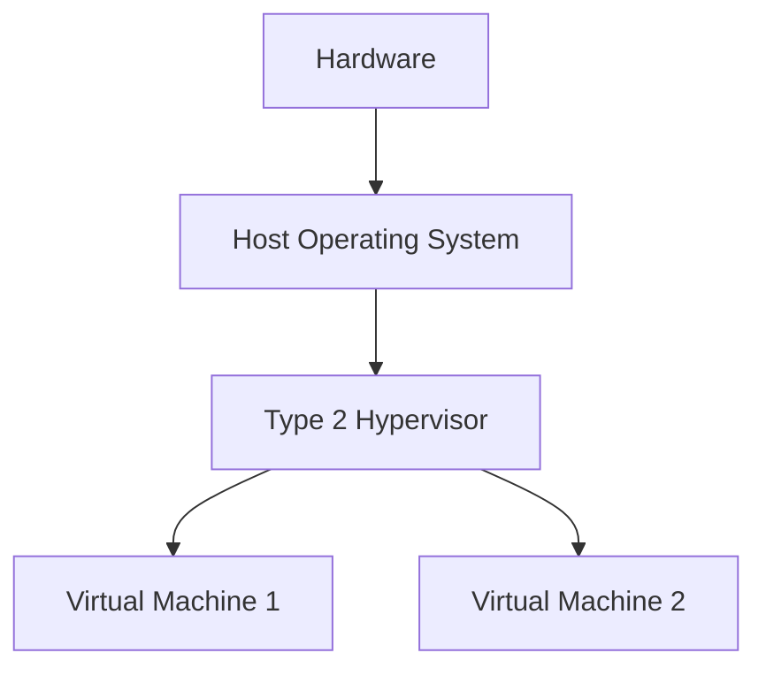

# Linux System Administration - Introduction & Linux Fundamentals

> Based on **Class-01** with additional explanations, historical context, practical examples, and Linux administration best practices.

---

# Table of Contents

1. [What is an Operating System?](#1-what-is-an-operating-system)
2. [Responsibilities of an Operating System](#2-responsibilities-of-an-operating-system)
3. [History of UNIX](#3-history-of-unix)
4. [Birth of Linux](#4-birth-of-linux)
5. [Linux vs UNIX](#5-linux-vs-unix)
6. [GNU Project](#6-gnu-project)
7. [Why GNU/Linux?](#7-why-gnulinux)
8. [Linux Distribution Ecosystem](#8-linux-distribution-ecosystem)
9. [Fedora → CentOS Stream → RHEL](#9-fedora--centos-stream--rhel)
10. [RHEL vs CentOS Stream](#10-rhel-vs-centos-stream)
11. [Linux Distribution Families](#11-linux-distribution-families)
12. [Package Formats & Package Managers](#12-package-formats--package-managers)
13. [Embedded Systems](#13-embedded-systems)
14. [Virtualization Basics](#14-virtualization-basics)
15. [Best Practices](#15-best-practices)
16. [Summary](#16-summary)

---

# 1. What is an Operating System (OS)?

An **Operating System (OS)** is system software that acts as an interface between the **user** and the **computer hardware**.

Without an operating system, applications cannot communicate directly with hardware such as:

- CPU
- RAM
- Storage
- Network devices
- USB devices
- Display

The OS manages these resources and provides services to applications.

---

## Operating System as a Bridge



The operating system hides hardware complexity from the user.

Instead of directly communicating with hardware, users interact with the OS.

---

# 2. Responsibilities of an Operating System

An operating system performs many important tasks.

## Process Management

- Creates processes
- Terminates processes
- Schedules CPU time
- Handles multitasking

---

## Memory Management

- Allocates RAM
- Frees unused memory
- Prevents applications from interfering with each other

---

## File System Management

Organizes data into:

- Files
- Directories
- Permissions

Examples:

```text
/home
/etc
/var
```

---

## Device Management

Controls devices like:

- Keyboard
- Mouse
- Printer
- Network card
- USB devices
- Storage drives

---

## User Management

Handles:

- User accounts
- Groups
- Authentication
- Permissions

---

## Network Management

Provides networking services including:

- IP configuration
- DNS
- Routing
- Firewalls
- Remote access

---

# 3. History of UNIX

UNIX is one of the most influential operating systems ever created.

It was developed in **1969** at **Bell Labs**.

Before UNIX, there was a project called **Multics**.

---

## Multics Project

Organizations involved:

- Bell Labs
- MIT
- General Electric

Goal:

Create an advanced multi-user operating system.

Problems:

- Extremely complex
- Slow
- Difficult to maintain
- Expensive

Because of these issues, Bell Labs withdrew from the project.

---

# 4. Birth of UNIX

Two Bell Labs researchers decided to build a simpler operating system.

They were:

- **Ken Thompson**
- **Dennis Ritchie** (creator of the C programming language)

Their goals:

- Simple
- Fast
- Reliable
- Multi-user

The result was **UNIX**.

UNIX later inspired nearly every modern operating system.

---

# 5. What is Linux?

Linux is **not a complete operating system**.

Linux is an **Operating System Kernel**.

The **kernel** is the core component responsible for:

- Process management
- Memory management
- Device communication
- Filesystem interaction
- Networking

Applications communicate with hardware through the kernel.

---

# 6. Creator of Linux

Linux Kernel was created by:

## Linus Torvalds

- Born: 1969
- Country: Finland
- Profession: Software Engineer

In **1991**, while studying at the University of Helsinki, Linus Torvalds released the first version of the Linux kernel.

Initially it was a personal project but quickly became one of the largest open-source collaborations in history.

---

# 7. GNU Project

Before Linux existed, **Richard Stallman** started the **GNU Project**.

The GNU Project developed many essential tools, including:

- Bash Shell
- GCC Compiler
- GNU Core Utilities
- Editors
- Libraries

However, GNU lacked a complete, production-ready kernel.

When the Linux kernel was combined with GNU tools, a complete operating system was formed.

---

# 8. Why is it called GNU/Linux?

Many people simply say:

```
Linux
```

However, Richard Stallman and the Free Software Foundation recommend:

```
GNU/Linux
```

Reason:

- Kernel comes from Linux.
- Most user-space tools come from GNU.

Therefore, the complete operating system consists of both projects.

---

# 9. Why is Linux Called Linux?

The name comes from:

```
Linus + UNIX
```

↓

```
Linux
```

Important facts:

- Linux is **not** a copy of UNIX.
- Linux is **UNIX-like**.
- Linux was independently developed.
- It follows many UNIX design principles.

Examples inherited from UNIX:

- File hierarchy
- Shell
- Permissions
- Processes
- Users
- Pipes
- Standard utilities

---

# 10. Linux Distribution Ecosystem

A Linux distribution combines:

- Linux Kernel
- GNU Tools
- Package Manager
- Desktop Environment (optional)
- Applications

Different organizations package Linux differently.

---

# 11. Fedora → CentOS Stream → RHEL

The Red Hat ecosystem follows this flow:


---

## Fedora

Fedora is the **upstream** distribution.

Characteristics:

- Latest technologies
- Community-driven
- Frequent updates
- New kernels
- New GNOME releases
- New systemd features

Best for:

- Developers
- Enthusiasts
- Testing new technologies

---

## CentOS Stream

CentOS Stream sits between Fedora and RHEL.

It is often described as a **rolling preview** of the next RHEL minor release.

Characteristics:

- Receives features before RHEL
- More stable than Fedora
- Less stable than RHEL
- Used for testing enterprise features

---

## Red Hat Enterprise Linux (RHEL)

RHEL is the enterprise edition.

Characteristics:

- Highly stable
- Commercial support
- Thorough testing
- Long-term support (10+ years)

Commonly used in:

- Banks
- Data centers
- Government
- Cloud infrastructure
- Telecommunications

---

# 12. Is CentOS Stream a Beta Version?

Not exactly.

A better description is:

> **Rolling Preview**

It continuously receives updates that are expected to appear in future RHEL releases.

---

# 13. RHEL vs CentOS Stream

| Feature | CentOS Stream | RHEL |
|----------|---------------|------|
| License | Free | Subscription (Developer edition available for free) |
| Support | Community | Official Red Hat Support |
| Updates | Rolling | Stable point releases |
| Stability | Very good | Highest |
| Target Users | Developers, testing | Enterprise production |

---

# 14. Linux Distribution Families

Many Linux distributions are based on another distribution.

These are known as **distribution families**.

---

## Red Hat Family

Package format:

```text
.rpm
```

Package manager:

```text
dnf
yum
```

Examples:

- RHEL
- Rocky Linux
- AlmaLinux
- Fedora
- CentOS Stream

---

## Debian Family

Package format:

```text
.deb
```

Package manager:

```text
apt
```

Examples:

- Debian
- Ubuntu
- Linux Mint
- Kali Linux

---

## Arch Family

Package format:

```text
.pkg.tar.zst
```

Package manager:

```text
pacman
```

Examples:

- Arch Linux
- Manjaro

---

## SUSE Family

Package format:

```text
.rpm
```

Package manager:

```text
zypper
```

Examples:

- openSUSE
- SUSE Linux Enterprise

---

## Gentoo Family

Package manager:

```text
Portage
```

Packages are generally built from source code.

---

## Slackware Family

Package formats:

```text
.tgz
.txz
```

Package manager:

```text
pkgtool
```

One of the oldest Linux distributions.

---

# 15. Package Managers

A package manager installs, updates, and removes software.

Examples:

| Distribution | Package Manager |
|--------------|-----------------|
| Ubuntu | apt |
| Debian | apt |
| Fedora | dnf |
| RHEL | dnf |
| Rocky Linux | dnf |
| AlmaLinux | dnf |
| Arch Linux | pacman |
| openSUSE | zypper |

Example:

Ubuntu:

```bash
sudo apt install nginx
```

Rocky Linux:

```bash
sudo dnf install nginx
```

Arch Linux:

```bash
sudo pacman -S nginx
```

---

# 16. Embedded Systems

An **Embedded System** is a specialized computer designed to perform one specific task.

Unlike general-purpose computers, embedded systems are optimized for dedicated functions.

Examples:

- Smart TV
- Router
- IP Camera
- Robot
- IoT Device
- Network Appliance
- Washing Machine
- Smart Refrigerator

Many embedded devices run Linux because it is:

- Stable
- Lightweight
- Open Source
- Highly customizable

---

# 17. Virtualization Basics

Virtualization allows multiple operating systems to run on a single physical machine.

There are two common types.

---

## Type 1 Hypervisor (Bare Metal)

Runs directly on the hardware.



Examples:

- VMware ESXi
- Microsoft Hyper-V Server
- Xen
- Proxmox VE

Advantages:

- Better performance
- Higher security
- Enterprise-grade

---

## Type 2 Hypervisor (Hosted)

Runs on top of an existing operating system.



Examples:

- VirtualBox
- VMware Workstation
- VMware Fusion
- Parallels Desktop

Advantages:

- Easy to install
- Great for learning
- Ideal for development and testing

---

# 18. Best Practices

- Learn Linux concepts before memorizing commands.
- Understand the difference between the Linux kernel and a Linux distribution.
- Practice with multiple distributions (Ubuntu, Rocky Linux, Fedora).
- Use virtual machines to experiment safely.
- Learn package management for your chosen distribution.
- Keep your system updated using the appropriate package manager.
- Use enterprise distributions (RHEL, Rocky Linux, AlmaLinux) for production servers.

---

# Summary

Linux is a powerful, open-source operating system built around the Linux kernel and commonly paired with GNU tools to form a complete operating system.

Key takeaways:

- An **Operating System** manages hardware resources and provides services to users and applications.
- **UNIX**, developed at Bell Labs in 1969, inspired many modern operating systems.
- **Linux**, created by **Linus Torvalds** in 1991, is a UNIX-like kernel, not a complete operating system by itself.
- The **GNU Project** supplies many essential user-space tools, which is why many refer to the system as **GNU/Linux**.
- Major Linux families include **Red Hat**, **Debian**, **Arch**, **SUSE**, **Gentoo**, and **Slackware**, each with its own package format and package manager.
- The Red Hat ecosystem follows the progression: **Fedora → CentOS Stream → RHEL**, balancing innovation, testing, and enterprise stability.
- Linux powers everything from servers and desktops to embedded systems, cloud infrastructure, and IoT devices, making it one of the most versatile operating systems in the world.