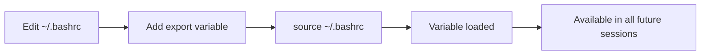

# Linux Shell & Basic Text Processing - Complete Study Notes

> Based on Class-02 with additional explanations, practical examples, and Linux administration best practices.

---

# Table of Contents

1. [What is Linux Shell?](#1-what-is-linux-shell)
2. [How Shell Works](#2-how-shell-works)
3. [Popular Linux Shells](#3-popular-linux-shells)
4. [Viewing Installed Shells](#4-viewing-installed-shells)
5. [Checking Your Current Shell](#5-checking-your-current-shell)
6. [Installing Different Shells](#6-installing-different-shells)
7. [Switching Shells](#7-switching-shells)
8. [Changing the Default Shell](#8-changing-the-default-shell)
9. [Applying Shell Changes](#9-applying-shell-changes)
10. [Bash vs Zsh](#10-bash-vs-zsh)
11. [EPEL Repository](#11-epel-repository)
12. [Basic Text Processing Commands](#12-basic-text-processing-commands)
13. [Environment Variables](#13-environment-variables)
14. [Persistent Environment Variables](#14-persistent-environment-variables)
15. [File Viewing Commands](#15-file-viewing-commands)
16. [Searching Text](#16-searching-text)
17. [Counting Lines and Words](#17-counting-lines-and-words)
18. [Best Practices](#18-best-practices)
19. [Summary](#19-summary)

---

# 1. What is Linux Shell?

A **Shell** is a **Command Line Interpreter (CLI)** that acts as an interface between the **user** and the **Linux Kernel**.

When you type a command into the terminal, the shell:

1. Reads the command.
2. Interprets it.
3. Sends it to the Linux Kernel.
4. The Kernel communicates with the hardware.
5. The result is returned to the shell.
6. The shell displays the output in the terminal.

Without the shell, users cannot directly communicate with the Linux kernel.

---

# 2. How Shell Works

## Request (Input) Flow


---

## Response (Output) Flow


This illustrates how the shell acts as a bridge between the user and the operating system.

---

# 3. Popular Linux Shells

Several shells are available in Linux, each offering different features.

| Shell | Full Name | Features | Best For |
|--------|-----------|----------|----------|
| Bash | Bourne Again Shell | Default shell on most Linux systems | Beginners to experts |
| Zsh | Z Shell | Auto-completion, plugins, themes | Developers and power users |
| Fish | Friendly Interactive Shell | User-friendly interface, autosuggestions | New users |
| Ksh | Korn Shell | Enterprise UNIX compatibility | System administrators |
| Csh / Tcsh | C Shell | C-like syntax | Academic and legacy systems |

---

## Bash

Most Linux distributions use **Bash** by default.

Features:

- Stable
- Portable
- Large community
- Extensive scripting support

---

## Zsh

Zsh is an enhanced version of Bash.

Features:

- Better auto-completion
- Command correction
- Powerful scripting
- Plugin support (Oh My Zsh)
- Beautiful themes

Popular among developers.

---

## Fish

Fish stands for:

> **Friendly Interactive Shell**

Features:

- Automatic suggestions
- Syntax highlighting
- Easy configuration
- Beginner-friendly

---

## Korn Shell (Ksh)

Widely used in enterprise UNIX systems.

Suitable for:

- Legacy applications
- Enterprise environments
- System administration

---

## C Shell (Csh/Tcsh)

Designed with syntax similar to the C programming language.

Mostly found on older systems and research environments.

---

# 4. Viewing Installed Shells

List all shells installed on the system:

```bash
cat /etc/shells
```

Example output:

```text
/bin/sh
/bin/bash
/usr/bin/zsh
/usr/bin/fish
```

---

# 5. Checking Your Current Shell

Display your default login shell:

```bash
echo $SHELL
```

Example:

```text
/bin/bash
```

---

## Current Running Shell

Sometimes your current shell differs from your login shell.

Check the current shell process:

```bash
echo $0
```

Example:

```text
zsh
```

This is useful when you temporarily switch shells.

---

# 6. Installing Different Shells

## Ubuntu / Debian

Install Zsh:

```bash
sudo apt install zsh -y
```

Install Fish:

```bash
sudo apt install fish -y
```

Install Korn Shell:

```bash
sudo apt install ksh -y
```

---

## RHEL / Rocky / AlmaLinux

Install Zsh:

```bash
sudo dnf install zsh -y
```

Install Fish:

```bash
sudo dnf install fish -y
```

Install Korn Shell:

```bash
sudo dnf install ksh -y
```

---

# 7. Switching Shells

There are two ways to switch shells.

---

## Temporary Switch

Only affects the current terminal session.

Switch to Zsh:

```bash
zsh
```

Switch to Fish:

```bash
fish
```

Return to Bash:

```bash
bash
```

Or simply exit the temporary shell:

```bash
exit
```

---

## Check Current Session Shell

```bash
echo $0
```

---

## Check Login Shell

```bash
echo $SHELL
```

These two values may differ after a temporary shell switch.

---

# 8. Changing the Default Shell

Find the shell path:

```bash
which zsh
```

Example:

```text
/usr/bin/zsh
```

Change the default shell:

```bash
chsh -s /usr/bin/zsh
```

Meaning:

| Option | Description |
|---------|-------------|
| chsh | Change Shell |
| -s | Specify new shell |
| /usr/bin/zsh | Full path to the new shell |

Example for Fish:

```bash
chsh -s /usr/bin/fish
```

---

# 9. Applying Shell Changes

A reboot is **not** required.

You can:

- Log out and log back in.
- Close and reopen the terminal.
- Reconnect via SSH.

The new login shell will then become active.

---

# 10. Bash vs Zsh

Changing the shell does **not** change how Linux works.

It only changes the command interpreter.

Example:

Suppose there are no `.txt` files in the current directory.

### Bash

```bash
echo *.txt
```

Output:

```text
*.txt
```

Bash prints the pattern unchanged.

---

### Zsh

```bash
echo *.txt
```

Output:

```text
zsh: no matches found: *.txt
```

Zsh reports an error because no files match the pattern.

---

## Prompt Differences

Typical Bash prompt:

```text
user@server:~$
```

Typical Zsh prompt:

```text
[user@server]%
```

These styles can be customized.

---

# 11. EPEL Repository

EPEL stands for:

> **Extra Packages for Enterprise Linux**

Install it:

```bash
sudo dnf install epel-release -y
```

EPEL provides additional packages that are not included in the default repositories.

Examples:

- htop
- btop
- fish
- fastfetch
- neofetch
- ansible (older releases)

Supported distributions:

- RHEL
- Rocky Linux
- AlmaLinux
- CentOS Stream

---

# 12. Basic Text Processing Commands

## cat

Display the contents of a file.

```bash
cat file.txt
```


Display multiple files:

```bash
cat file1.txt file2.txt
```

Create a file:

```bash
cat > file.txt
```

Append to a file:

```bash
cat >> file.txt
```

---

## echo

Print text to the terminal.

```bash
echo "Hello World"
```

Display variables:

```bash
echo $HOME
```

```bash
echo $PWD
```

```bash
echo $HOSTNAME
```

```bash
echo $SHELL
```

---

# 13. Environment Variables

## Temporary Variable

Create:

```bash
myname="Rahman"
```

Display:

```bash
echo $myname
```

Delete:

```bash
unset myname
```

Temporary variables disappear after the shell session ends.

```mermaid
flowchart LR
    A[Create variable] --> B[myname="Rahman"]
    B --> C[Available in current session]
    C --> D[Session ends]
    D --> E[Variable disappears]
```

---

# 14. Persistent Environment Variables

To make variables permanent, edit:

```bash
vim ~/.bashrc
```

Add:

```bash
export CEO="Mr. Souhardo"
```

Reload the configuration:

```bash
source ~/.bashrc
```

Verify:

```bash
echo $CEO
```

This variable will now be available in future Bash sessions.



---

# 15. File Viewing Commands

## head

Display the beginning of a file.

Default (10 lines):

```bash
head file.txt
```

First 5 lines:

```bash
head -n 5 file.txt
```

---

## tail

Display the end of a file.

```bash
tail file.txt
```

Last 5 lines:

```bash
tail -n 5 file.txt
```

---

## Live Monitoring

```bash
tail -f logfile.txt
```

Useful for:

- Web server logs
- System logs
- Application logs

Press **Ctrl + C** to stop monitoring.

---

## less

Open large files interactively.

```bash
less file.txt
```

Useful navigation:

| Key | Action |
|-----|--------|
| Space | Next page |
| b | Previous page |
| /text | Search forward |
| n | Next search result |
| q | Quit |

---

# 16. Searching Text

## grep

Search for text inside files.

```bash
grep "hello" file.txt
```

```mermaid
flowchart LR
    A[grep "pattern" file] --> B[Search file]
    B --> C{Match found?}
    C -->|Yes| D[Return matching lines]
    C -->|No| E[No output]
```

Ignore case:

```bash
grep -i "hello" file.txt
```

Recursive search:

```bash
grep -r "hello" /path/
```

Show line numbers:

```bash
grep -n "hello" file.txt
```

Examples:

```bash
grep "root" /etc/passwd
```

```bash
grep -i "error" logfile.log
```

---

# 17. Counting Lines and Words

## wc

Count lines, words, and characters.

```bash
wc file.txt
```

Output:

```text
12 95 640 file.txt
```

Meaning:

- 12 lines
- 95 words
- 640 characters

Only lines:

```bash
wc -l file.txt
```

Only words:

```bash
wc -w file.txt
```

Only characters:

```bash
wc -m file.txt
```

---

# 18. Best Practices

- Learn Bash thoroughly before switching to another shell.
- Use Zsh if you want advanced auto-completion and plugin support.
- Use Fish if you prefer an easy-to-use interactive shell.
- Keep your `.bashrc` or `.zshrc` organized with comments.
- Avoid creating unnecessary global environment variables.
- Use `less` instead of `cat` for large files.
- Use `tail -f` to monitor logs in real time.
- Use `grep` to quickly search configuration files and logs.
- Enable the EPEL repository only when additional packages are required.

---

# Summary

The Linux Shell is the command interpreter that connects users with the Linux kernel, enabling command execution and interaction with the operating system.

Key points:

- **Shell** acts as the interface between the user and the Linux kernel.
- **Bash** is the default shell on most Linux distributions.
- **Zsh** and **Fish** offer enhanced features such as autosuggestions and improved completion.
- **`cat`**, **`head`**, **`tail`**, **`less`**, **`grep`**, and **`wc`** are essential tools for viewing and processing text.
- **Environment variables** can be temporary or persistent.
- **EPEL** provides additional software packages for Enterprise Linux distributions.

Mastering the shell and these core text-processing tools forms the foundation for effective Linux system administration and scripting.